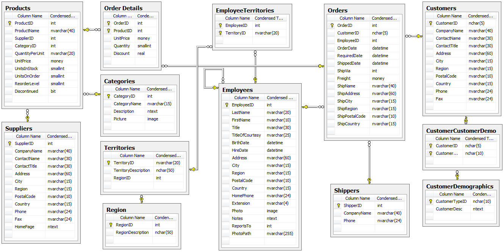
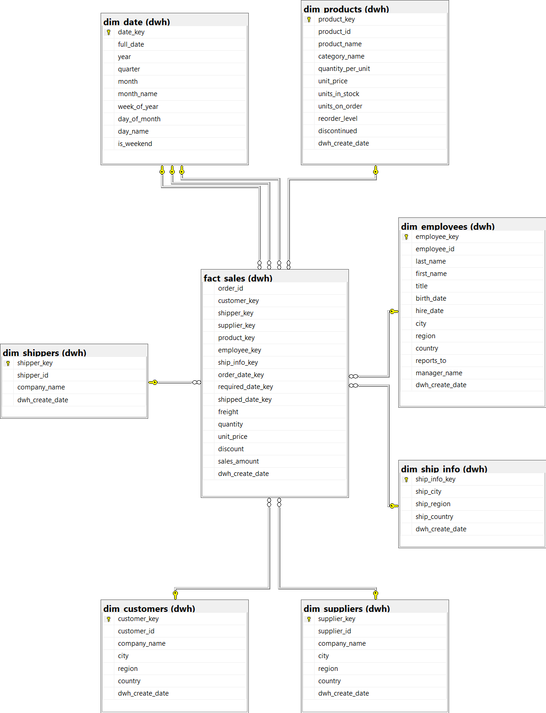
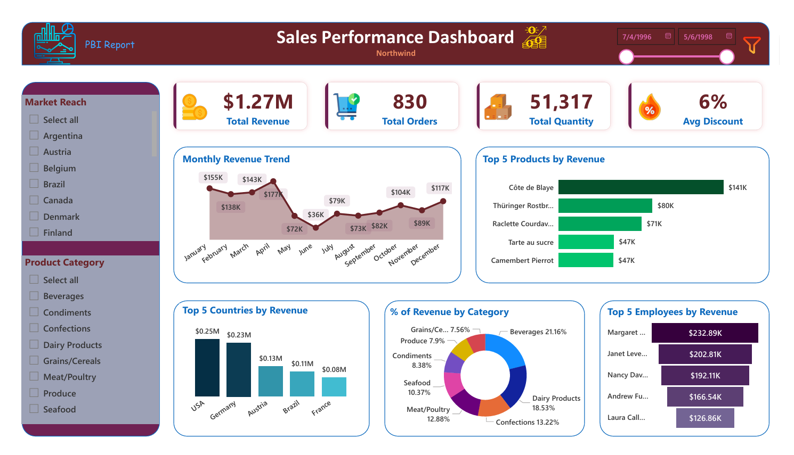

# 🏢 Northwind End-to-End Data Warehouse & Sales Intelligence Solution

Welcome to the **Northwind Sales Intelligence** repository! 🚀
This project showcases a comprehensive **End-to-End Data Warehouse** solution, transforming raw **OLTP** data into actionable business insights. Using a robust **ETL Pipeline (SSIS)** and **Star Schema modeling**, it demonstrates industry-standard practices in **Data Engineering, Data Warehousing, and Interactive Analytics with Power BI**.

---

## 🏗️ The Data Journey (End-to-End Architecture Flow)

This project follows a systematic approach to transform raw operational data into strategic business intelligence. Below is the step-by-step evolution of the data:

### 🗄️ 1. Source System (OLTP)
The journey begins with the Northwind RDBMS, a transactional database. The ERD was analyzed to identify key entities and relationships required for sales analysis.



### 🔄 2. ETL Data Pipeline (SSIS)
Developed and automated robust **ETL Data Pipeline** using **SQL Server Integration Services (SSIS)** to orchestrate the seamless flow of data from the **OLTP** DB source to the **OLAP** Data Warehouse. The pipeline is architected into three strategic phases:

- 1️⃣ **Extract to Staging Layer**: Mirrored **Raw Data** from the source into a dedicated staging area to ensure zero performance impact on the production environment.

.png)
.png)

📌 Check all ETL Packages of the Staging Layer in: [Screenshots of Staging Layer Packages](Screenshots-Staging-Layer-Packages/)

- 2️⃣ **Transformations**: Applied business logic, including data cleansing, handling null values, and flattening hierarchies. Calculated measures like `Sales Amount` were generated at this stage to ensure analytics readiness.

- 3️⃣ **Loading to Data Warehouse**: Executed optimized loading patterns into the **Star Schema**, ensuring data integrity and referential consistency across all dimensions and facts.

#### ➜ Dim_Employees

.png)
.png)

#### ➜ Dim_Products

.png)
.png)

#### ➤ Fact_Sales

.png)
.png)

📌 Check all ETL Packages of the Data Warehouse in: [Screenshots of Data Warehouse Packages](Screenshots-Data-Warehouse-Packages/)

### ⭐ 3. Data Warehouse Modeling (Star Schema)
The heart of the project is a **Star Schema** designed for performance and clarity. Various dimensional modeling techniques were implemented to ensure the data is **analytics-ready**.



#### 📜 Dimensional Modeling Details

| Element          | Type                         | Business Logic & Description |
|------------------|------------------------------|-------------------------------|
| `dim_date`       | **Static / Role-Playing**    | Handles **Order**, **Shipped**, and **Required** dates through a single timeline reference. |
| `dim_customers`  | **SCD Type 1**               | Maintains up-to-date customer profiles and geographical attributes. |
| `dim_products`   | **SCD Type 1**               | Stores product catalog, categories, and unit price snapshots. |
| `dim_employees`  | **SCD Type 1**               | Captures staff details and flattens the **Manager-Subordinate hierarchy**. |
| `dim_suppliers`  | **SCD Type 1**               | Tracks product origins and supplier locations. |
| `dim_shippers`   | **SCD Type 1**               | Identifies logistics providers for delivery performance tracking. |
| `dim_ship_info`  | **Junk Dimension**           | Consolidates shipping destination attributes to optimize Fact table grain. |
| `order_id`       | **Degenerate Dimension**     | Kept in the Fact table to ensure **Data Lineage** back to the OLTP source. |
| `fact_sales`     | **Fact Table**               | Centralized metrics: **Sales Amount**, Quantity, Discount, and Freight costs. |

### 📊 4. Data Visualization & Insights (Power BI)
Leveraged **Power BI** to build a dynamic analytics layer by connecting directly to the **OLAP Data Warehouse**. The solution features an integrated, **interactive Dashboard** that tracks cross-functional **KPIs** and sales performance, enabling stakeholders to uncover hidden trends and empower **data-driven decisions** through high-fidelity visualizations.



---

## 📖 Project Overview

The **Northwind Sales Intelligence** project is a comprehensive **End-to-End Data Engineering** solution designed to transform raw **transactional data (OLTP)** into a high-performance analytical environment.

By architecting a robust **SSIS-based ETL pipeline**, the project ensures seamless data flow through a dedicated **Staging layer** to maintain data integrity. The final solution provides a specialized **OLAP Data Warehouse** based on a **Star Schema**, serving as a single source of truth for high-fidelity **Power BI** visualizations and data-driven decision-making.

---

## 🛠️ Tools & Technologies Used

| Tool / Technology | Purpose |
|-------------------|---------|
| **SQL Server Management Studio (SSMS)** | GUI for managing and interacting with databases. |
| **SQL Server (RDBMS)** | Used for hosting the source **OLTP** database and the specialized **OLAP** Data Warehouse. |
| **SQL (T-SQL)** | Utilized for writing optimized **DDL** scripts, data cleansing logic, and schema design. |
| **SQL Server Integration Services (SSIS)** | The core **ETL** engine used for data extraction, transformations, and automated loading. |
| **Visual Studio** | The integrated development environment (IDE) used for building and deploying SSIS packages. |
| **Power BI** | The primary **Business Intelligence** tool for creating interactive dashboards and performing advanced data analysis. |

---

## 🚀 Project Requirements

### Building the BI Solution (End-to-End)

#### Objective
Develop a robust, automated Data Warehouse to transform raw Northwind transactional data into structured, business-ready insights using **SSIS**, **SQL Server**, and **Power BI**.

#### Specifications
- **Data Source**: Utilize the **Northwind (OLTP)** database to simulate real-world retail operations and complex relational data.
- **ETL Architecture**: Design a multi-stage pipeline (**Source** to **Staging** to **DWH**) using **SSIS** to automate extraction, transformations, and loading.
- **Data Quality**: Implement cleansing logic to resolve nulls and ensure referential integrity across the pipeline.
- **Dimensional Modeling**: Architect a **Star Schema** with optimized Fact and Dimension tables (SCDs, Junk, Degenerate Dimension, and Role-playing) for high-performance querying.
- **Business Intelligence**: Connect the **OLAP** warehouse to **Power BI** to deliver interactive dashboards and track strategic KPIs.

---

## 🔑 Key Features

- 🛡️ **Isolated Staging Layer**: Implemented a **Raw Data Staging** area to ensure data consistency and protect production system performance.
- 🔄 **Automated ETL Pipeline**: End-to-end orchestration using **SSIS** to automate the flow of data from source to destination.
- 🧹 **Data Cleansing & Transformation**: Robust logic to handle nulls, flatten complex hierarchies, and generate calculated business measures.
- ⭐ **Dimensional Modeling**: A high-performance **Star Schema** featuring **SCDs Type 1**, **Junk Dimension**, and **Role-playing Dimension**.
- 🔍 **Data Lineage & Integrity**: Utilization of **Degenerate Dimension** (`order_id`) to maintain a direct audit trail back to the OLTP source.
- 📊 **Data Visualization & Insights**: Interactive **Power BI** dashboard to monitor **KPIs**, track **sales trends**, and provide **actionable insights**.

---

## 📂 Repository Structure

```
northwind-data-warehouse-etl-powerbi/              # Repository Root
│
├── SSIS-ETL-Packages/                             # ETL layer using SSIS (All ETL packages)
│   │
│   ├── Data-Warehouse-Packages/                   # DWH packages (Dim & Fact loading)
│   │   └── Contains all SSIS packages for the Data Warehouse
│   │
│   └── Staging-Layer-Packages/                    # Staging Layer packages (Raw data extraction from OLTP)
│       └── Contains all SSIS packages for the Staging Layer
│
├── Screenshots-Data-Warehouse-Packages/          # Documentation of ETL Workflows
│   └── Contains all screenshots of Execution flow & Control Flow for all DWH packages
│
├── Screenshots-Staging-Layer-Packages/           # Documentation of ETL Workflows
│   └── Contains all screenshots of Execution Flow & Control Flow for all Staging Layer packages
│
├── docs/                                          # Project documentation & architecture diagrams
│   ├── Northwind OLTP DB.png
│   ├── Northwind_Dashboard.png
│   └── Star Schema.png
│
├── scripts/                                       # SQL scripts (DDL scripts for Staging Layer & DWH)
│   ├── DDL Data Warehouse.sql
│   └── DDL Staging Layer.sql
│
├── source-oltp-database/                          # OLTP source system (Northwind backup DB)
│   └── Northwind.bak
│
├── Northwind_Sales_Report.pbix                   # Power BI Report file
├── Northwind_Sales_Report.pdf                    # Static export of the analytical report
│
├── .gitignore                                    # Files and directories to be ignored by Git
├── LICENSE                                       # License information for the repository
└── README.md                                     # Project overview and documentation
```

---

## 🛡️ License

This project is licensed under the [MIT License](LICENSE). You are free to use, modify, and share this project with proper attribution.

---

## 🌟 About Me

Hi! I'm **Abdullah Emad**, a **Data Engineer** driven by a core mission: **Transforming raw data into reliable, actionable assets**.

I focus on architecting robust infrastructure that makes data clean, organized, and ready for action. I believe that well-architected data is the backbone of every great decision, and I’m dedicated to implementing best practices to ensure data quality and scalability.

Let’s connect to discuss data, insights, or professional opportunities:

[](https://www.linkedin.com/in/abdullah-emad-abdullah/)
